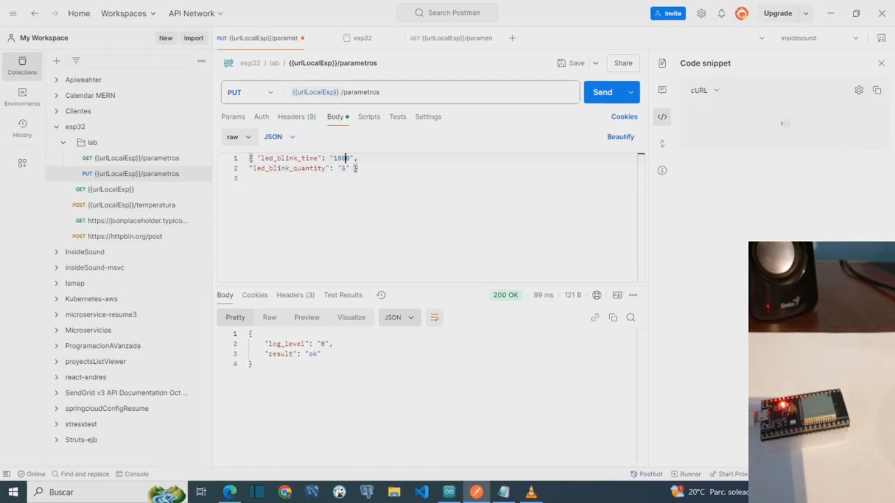
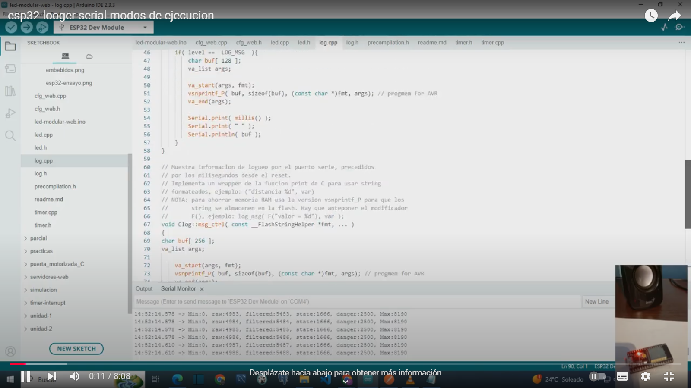

 # ESP32-WROOM-REV3: Web-Controlled LED Blink Project

## Project Overview
This project demonstrates a modular architecture for the ESP32-WROOM-REV3 using Arduino. It supports complex, non-blocking control systems and provides web-based control, data persistence, and serial output in JSON, text, and plotting formats. 

### Key Features:
- **Non-Blocking Methods**: Supports non-blocking timers for managing LEDs and controlling devices like motorized doors. 
- **Web Control**: Hosts a web server on port 8080 to adjust parameters dynamically.
- **Data Persistence**: Ensures configurations remain consistent across reboots.
- **State Machines**: Implements a primary state machine for high-level operations and secondary machines (e.g., PID control for precision tasks).
- **Serial Output Options**: Offers flexible logging in JSON, plain text, and formats compatible with Arduino Plotter.

---

## Project Structure

### File Descriptions:
- `log.h`: Logging utilities.
- `cfg_web.h`: Web configuration management.
- `led.h`: LED control module.
- `precompilation.h`: Precompilation options for flexibility.
- `timer.h`: Non-blocking timer utilities.
- **Main .ino file**: Manages Wi-Fi, web server initialization, and state machine coordination.

---

## Example Setup
The provided code:
1. Establishes a Wi-Fi connection.
2. Sets up a web server for dynamic configuration.
3. Manages LED blinking with adjustable, non-blocking timers.
4. Logs activities to the serial monitor for real-time debugging.

---

## Configuration
### Wi-Fi Credentials:
Replace the placeholders in the code:
```cpp
const char* ssid = "your-network-SSID";
const char* password = "your-network-password";

---

## API Endpoints

### Retrieve Parameters
You can retrieve the device’s configured parameters via the GET endpoint:

Endpoint: GET `{{urlLocalEsp}}/config`

Example using cURL:  
`curl --location 'http://192.168.0.53:8080/config'`

---

### Modify Parameters and Send Commands
To modify parameters or send commands, use the PUT endpoint:

Endpoint: PUT `{{urlLocalEsp}}/config`

Example using cURL:  
`curl --location --request PUT 'http://192.168.0.53:8080/config' --header 'Content-Type: application/json' --data '{ "log_level": "1" }'`

---

### Available Parameters and Commands
General Information:  
- `{ "info": "all-params" }` - Sends all parameters in JSON format.

Log Level:  
- `{ "log_level": "0" }` - Log level 0: Disabled.  
- `{ "log_level": "1" }` - Log level 1: Basic messages.  
- `{ "log_level": "2" }` - Log level 2: Standard control info.  
- `{ "log_level": "3" }` - Log level 3: Arduino plotter compatible format.

Control Commands:  
- `{ "cmd": "start" }` - Starts the test.

---

### Demo JSON Serial Output
`{ "st_mode": "200", "log_level": "2" }`

---

### Demo Arduino Plotter Serial Output
`{ "st_mode": "200", "log_level": "3" }`

---

### Parameter Configuration:
- `{ "led_blink_time": "1000" }` - LED blink time in ms.  
- `{ "led_blink_quantity": "5" }` - Number of LED blinks.  
- `{ "st_mode": "0" }` - Sets the test mode:  
  - `0` - ST_MODE_TEST: Test enabled.  
  - `200` - ST_MODE_DEMO: Demo enabled.


# Usage
Compile and Upload: Use Arduino IDE 2.3.3 to compile and upload the code to your ESP32.
Serial Logging: Adjust log levels dynamically through serial commands.
Author: [educacion.ta@gmail.com]
Date: 07-10-2024


Problems in embedded firmware design
[](https://youtu.be/KhKX23DdfLY)

[Presentation](doc/embebidos.pdf)


ESP32-Test execution-Debug via serial port-Data persistence
[](https://youtu.be/BXJvdTQ8DYk)

ESP32 - Execution modes - Logger via serial port
[](https://youtu.be/TlgQHpessV4)


