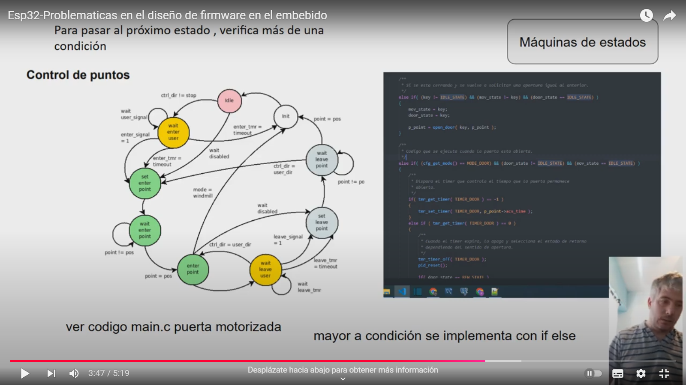

ESP32 Web-Controlled LED Blink  Project
Project Overview
This project demonstrates a modular architecture for the ESP32 using Arduino, designed to support complex,
 non-blocking control systems. The system provides web-based control, data persistence, and serial output,
  compatible with JSON, text, and plotting formats. It features a state machine structure that can be easily 
  adapted for various applications, such as controlling a motorized door with precise position tracking.
   In the included example, an LED blinks using adjustable non-blocking timers.

Features
Non-Blocking Method Support: Architected to handle non-blocking control, suitable for managing complex devices like motorized doors.
 For instance, the system manages a main state machine for the overall door states and an additional state machine
  with PID control for precise position management.
Web Service Control: Hosts a web server on port 80, allowing dynamic control of settings and states via HTTP GET and PUT requests.
Data Persistence: Ensures configurations are stored and can be dynamically updated, providing consistent functionality across reboots.
Flexible Serial Output: Supports structured serial output in JSON, plain text, and plotting formats for real-time data logging and debugging.
State Machine Implementation: A primary state machine oversees high-level device states,
 with support for secondary control processes, such as PID-based position control for motorized operations.
Non-Blocking Timers: LED blinking and other timed actions are managed with non-blocking timers
 ensuring smooth operation without delaying main processes.
Project Structure
File Descriptions:
log.h / cfg_web.h / led.h / precompilation.h / timer.h: Define logging, configuration handling, LED control, precompilation options, and timer utilities.
Main .ino file: Initializes Wi-Fi, web server, and hardware, and coordinates control flow with a state machine.
Example Setup
The provided code:

Establishes a Wi-Fi connection and initializes a web server for control access.
Uses non-blocking timers for managing the LED blink rate.
Logs activity and states to the serial monitor, facilitating debugging and real-time adjustments.
This framework offers a solid foundation for adding complex devices like motorized doors,
 enabling precise control through multiple state machines and supporting PID-based adjustments.

Configuration
Wi-Fi Credentials: Replace ssid and password with your network details.
State Machine States: Core states are managed through ST_LOOP_INIT, ST_LOOP_IDLE, ST_LOOP_LED_ON, and ST_LOOP_LED_OFF.

API Endpoints
1. Retrieve Parameters
You can retrieve the device’s configured parameters via the GET endpoint:

Endpoint: GET {{urlLocalEsp}}/obtenerParametros

Example using cURL: curl --location 'http://192.168.0.53/obtenerParametros'

2. Modify Parameters and Send Commands
To modify parameters or send commands, use the PUT endpoint:

Endpoint: PUT {{urlLocalEsp}}/parametros

Example using cURL:curl --location --request PUT 'http://192.168.0.53/parametros' \
--header 'Content-Type: application/json' \
--data '{ "log_level": "1" }'

Available Parameters and Commands
Here are the parameters and commands you can send in JSON format within the request body:

General Information:

{ "info": "all-params" } - Sends all parameters in JSON format.
{ "info": "all-calibration" } - Sends all calibration parameters in JSON format.
{ "info": "version" } - Sends the firmware version.
{ "info": "status" } - Returns the current test status.
{ "info": "point_position" } - Returns the point position.
{ "info": "point_speed" } - Returns the point speed.
{ "info": "dead_zone_min" } - Returns the start of the dead zone.
{ "info": "dead_zone_max" } - Returns the end of the dead zone.
{ "info": "speed_dead_zone" } - Returns the speed in the dead zone.
{ "info": "led_blink_time" } - Returns the LED blink time in ms.
{ "info": "led_blink_quantity" } - Returns the quantity blink times.
{ "info": "st_mode" } - Returns the test mode.
{ "info": "log_level" } - Returns the serial port log level.
Log Level:

{ "log_level": "0" } - Log level 0: Disabled.
{ "log_level": "1" } - Log level 1: Basic messages.
{ "log_level": "2" } - Log level 2: Standard control info.
{ "log_level": "3" } - Log level 3: Arduino plotter compatible format.
Control Commands:

{ "cmd": "start" } - Starts the test.
Parameter Configuration:

{ "point_position": "100" } - Sets the point position.
{ "point_speed": "200" } - Sets the point speed.
{ "dead_zone_min": "1" } - Configures the start of the dead zone.
{ "dead_zone_max": "2" } - Configures the end of the dead zone.
{ "speed_dead_zone": "150.0" } - Configures the speed in the dead zone.
{ "led_blink_time": "1000" } - LED blink time in ms.
{ "led_blink_quantity": "5" } – Cantidad de veces del parpadeo del LED.
{ "st_test": "1" } - Enables the test (0 for disabled, 1 for enabled).
{ "st_mode": "0" } - Sets the test mode:
0 - ST_MODE_TEST: Test enabled.
1 - ST_MODE_HOME_M2: Go to motor 2 home.
2 - ST_MODE_CELL: Read load cells.

Usage
Compile and Upload: Use Arduino IDE 2.3.3 to compile and upload the code to your ESP32.
Serial Logging: Adjust log levels dynamically through serial commands.
Author: [educacion.ta@gmail.com]
Date: 07-10-2024

Problems in embedded firmware design

Presentation
